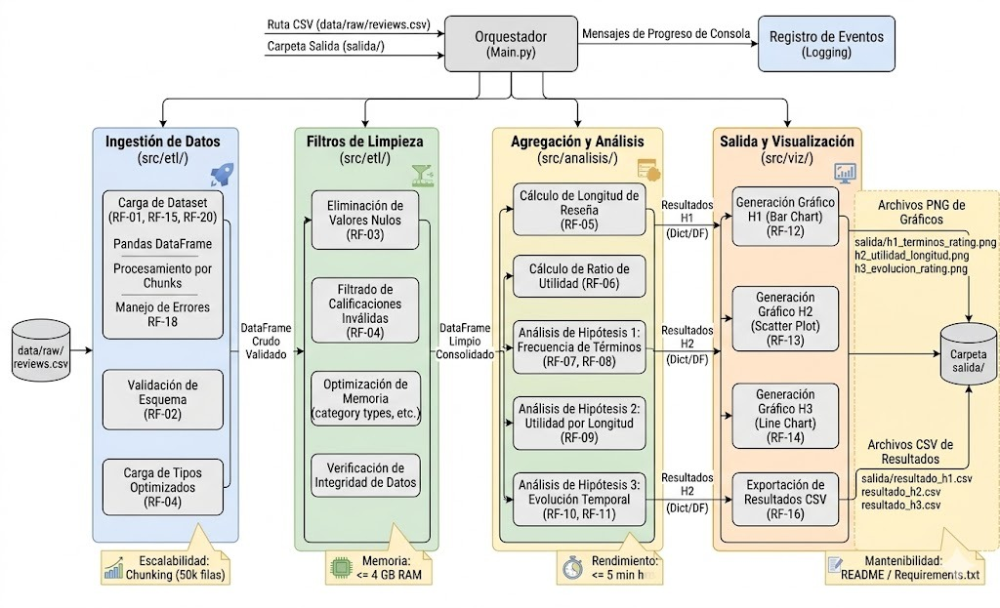

# Proyecto big data

## Desarrollado por:
    -Juan Camilo Cortes
    -Juan Camilo Ibarra
    -Isaac Daniel Moreno
    -Andruw Sarrias

## Estructura del proyecto:
   C:

    ├───docs
    └───src
        ├───analisis
        ├───etl
        ├───modelos
        ├───utils
        └───viz

## Esquema preliminar de bloques ETL

## Dataset a analizar: [Aqui](https://www.kaggle.com/datasets/shivamparab/amazon-electronics-reviews/data)

## Inicializacion del proyecto
### Instalacion de dependencias
Es recomendable ejecutar un entorno virtual con los comandos:
    python -m venv env
    source env/Scripts/activate --> Para windows
    env/bin/acrivate.bat --> Para Mac/Linux

Dependencias recomendadas:
    pip install pipenv --> Facilita la gestion de archivos, si cuentas con el puedes reemplazar los pip por pipenv

Dependencias obligatorias: 
    pip install kagglehub==1.0.2
    pip install pandas==3.0.3
    pip install pytest==9.1.1